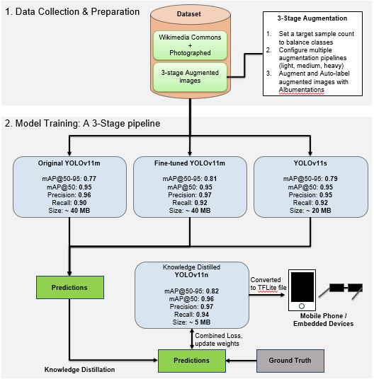

<div align="center">

# 🏛️ MonuAI

**AI-Powered Singapore Landmark Detection & Gamification App**

[](https://flutter.dev)
[](https://www.tensorflow.org/lite)
[](https://github.com/ultralytics/ultralytics)
[](https://python.org)

*Scan Singapore landmarks in real-time, earn rewards, and compete with friends!*

</div>

---

<div align="center">

### 📺 Demo


</div>

---

## 📱 About

**MonuAI** is a mobile application that detects Singapore landmarks in real-time using a custom-trained YOLOv11 model deployed on-device via TensorFlow Lite. The project spans the full ML pipeline — from data collection and augmentation, through teacher-student knowledge distillation, to a gamified Flutter app with GPU-accelerated inference.

Built as part of the **AAI3001 Computer Vision** course at the Singapore Institute of Technology (SIT).

---

## 🔬 ML Pipeline Overview

The model development follows a structured three-stage pipeline, each documented in its own notebook:

| Stage | Notebook | Description |
|-------|----------|-------------|
| **Data** | `landmark_detection_YOLOv11_data.ipynb` | Dataset verification, class balancing, augmentation, and stratified splitting |
| **Training** | `landmark_detection_YOLOv11_training.ipynb` | Teacher-student training with knowledge distillation |
| **Analysis** | `landmark_detection_YOLOv11_analysis.ipynb` | Video inference, Grad-CAM interpretability, and model comparison |

---

## 📊 Stage 1: Data Preparation & Balancing

The raw dataset contains images of **4 Singapore landmarks** annotated in YOLO format. The data notebook addresses class imbalance and prepares training-ready splits.

**Pipeline steps:**

1. **Dataset Verification** — Validates directory structure, checks image-label synchronization, and loads class definitions
2. **Class Distribution Analysis** — Identifies imbalance across the 4 landmark classes with visual diagnostics
3. **Sample Visualization & Quality Check** — Renders bounding box annotations on sample images to verify label accuracy
4. **Balanced Data Augmentation** — Uses [Albumentations](https://albumentations.ai/) to create a balanced dataset through class-specific augmentation strategies (rotation, flipping, color jitter, perspective transforms) with seed `42` for reproducibility
5. **Stratified Train/Val/Test Split** — Generates YOLO-compatible dataset splits with stratification by class, ensuring balanced representation in each partition

---

## 🧠 Stage 2: Model Training & Knowledge Distillation

The training notebook implements a multi-model framework targeting **>80% mAP@50-95**.

### Training Architecture



### Training Stages

1. **Teacher Model (YOLOv11m)** — Baseline training with optimized hyperparameters for landmark detection
2. **Enhanced Teacher (YOLOv11m)** — Advanced optimization targeting >80% mAP@50-95 with tuned learning rate, augmentation, and regularization
3. **Ensemble Model (YOLOv11s)** — Complementary model with different hyperparameters (higher LR, larger batch, 120 epochs) to provide diverse predictions
4. **Knowledge Distillation (YOLOv11n)** — Student model trained with true distillation loss from the ensemble of 3 teacher models, transferring soft targets rather than pseudo-labels
5. **Model Comparison** — Comprehensive evaluation of all 4 models across performance metrics, model size, and inference efficiency

### Why Knowledge Distillation?

The YOLOv11n student model (2.6M parameters) is ~8.5× smaller than the YOLOv11m teacher (22M parameters), making it suitable for real-time mobile inference while retaining the detection quality learned from the larger ensemble.

---

## 🔍 Stage 3: Model Analysis & Interpretability

The analysis notebook provides deep evaluation of the trained models through multiple techniques.

### Video Inference Analysis
- Per-model FPS benchmarking on real Singapore landmark footage
- Winner-Takes-All ensemble comparison across all frames
- Combined side-by-side comparison video of all model predictions

### Attention Visualization Methods

| Method | Purpose |
|--------|---------|
| **Grad-CAM** | Standard gradient-weighted class activation maps for understanding model focus |
| **Grad-CAM++** | Enhanced localization with pixel-wise weighting, better for multiple objects |
| **HiResCAM** | High-resolution attention maps without upsampling artifacts |
| **C2PSA Visualization** | YOLOv11's native Cross Stage Partial with Spatial Attention module |

### Additional Analysis
- **Intermediate Layer Feature Extraction** — Visualizes what different network layers learn (edges → textures → semantic features)
- **Confusion Matrix & Classification Report** — Quantitative per-class performance breakdown
- **Comprehensive Heatmap Dashboard** — Unified side-by-side comparison of all attention methods

---

## 📱 Mobile Application

### ✨ Key Features

- 🎯 **Real-Time Detection** — YOLOv11n with TFLite GPU Delegate V2, processing every 15th frame
- 📸 **Smart Capture** — Auto-saves clean photos, runs prediction on-demand
- 🎮 **Gamification** — Points, XP, levels, and achievements for discovering landmarks
- 🎡 **Fortune Wheel** — Spin to win 50–200 bonus points
- 🏆 **Leaderboard** — Compete with other users ranked by level and XP
- 🎖️ **Achievements** — Track progress across challenge categories
- 🌐 **Landscape Mode** — Full-screen detection experience

### Detection Flow

1. **Scan Screen** — Landscape camera preview with GPU-accelerated inference. Smart description positioning avoids overlapping bounding boxes using a 6-position fallback system (right → left → below → above → right-bottom → left-bottom).
2. **Photo Screen** — Loads TFLite model, runs inference on captured photo, draws bounding boxes with confidence scores, and auto-confirms landmark discovery.

### Gamification System

| Action | Points | XP | Spins |
|--------|--------|----|-------|
| Detect Landmark | +5 | +2 | +1 |

**Leveling:** 2 XP per detection, 10 XP per level threshold (level 1 = 10 XP, level 2 = 20 XP, etc.)

**Fortune Wheel:** 🟢 50 · 🔵 75 · 🟡 100 · 🟠 125 · 🟣 150 · 🔴 200 points

---

## 🚀 Getting Started

### Prerequisites

- Flutter SDK 3.8.1+
- Android device or emulator (API 21+)
- Android Studio or VS Code with Flutter extension

### Installation

```bash
git clone https://github.com/AnJayAx/monuai.git
cd monuai

flutter clean
flutter pub get
flutter run
```

### Build Release APK

```bash
flutter build apk --release
```

### Running the Notebooks

The ML notebooks require Python 3.10+ with the following key dependencies:

```bash
pip install ultralytics opencv-python albumentations tensorflow scikit-learn matplotlib seaborn
```

Run them in order: **Data → Training → Analysis**.

---

## 📁 Project Structure

```
monuai/
├── lib/
│   ├── main.dart                        # App entry point
│   ├── models/
│   │   └── gamification_models.dart     # Data models for points, XP, achievements
│   ├── screens/
│   │   ├── scan_screen.dart             # Real-time camera detection (landscape)
│   │   ├── landmark_photo_screen.dart   # On-demand photo prediction
│   │   ├── home_screen.dart             # Dashboard with stats
│   │   ├── leaderboard_screen.dart      # Player rankings
│   │   ├── fortune_wheel_screen.dart    # Spin-to-win rewards
│   │   └── achievements_screen.dart     # Progress tracking
│   └── services/
│       └── gamification_service.dart    # Core game logic & state
├── assets/
│   ├── models/
│   │   └── model_fp32_student.tflite    # Distilled YOLOv11n model
│   ├── labels.txt                       # 4 landmark class names
│   └── landmark_descriptions.json       # Info text per landmark
├── android/                             # Android build configuration
│
├── landmark_detection_YOLOv11_data.ipynb      # Data preparation notebook
├── landmark_detection_YOLOv11_training.ipynb   # Model training notebook
└── landmark_detection_YOLOv11_analysis.ipynb   # Analysis & interpretability notebook
```

---

## 🤖 Model Specifications

| Property | Value |
|----------|-------|
| Architecture | YOLOv11 Nano (student) |
| Parameters | ~2.6M |
| Input Size | 640 × 640 |
| Format | FP32 TensorFlow Lite |
| Acceleration | GPU Delegate V2 |
| Classes | 4 Singapore landmarks |
| Frame Stride | 15 (scan mode) |
| Training | Knowledge distillation from 3-model ensemble |

---

## 🐛 Troubleshooting

<details>
<summary><b>ADB: App fails to install or launch</b></summary>

```bash
adb kill-server
adb start-server
adb devices
adb install -r -t "build/app/outputs/flutter-apk/app-debug.apk"
adb shell am start -n com.example.monuai/com.example.monuai.MainActivity
```
</details>

<details>
<summary><b>VS Code: Gradle import errors ("phased build action failed")</b></summary>

These errors come from the Red Hat Java extension, not Flutter. If `flutter run` succeeds, they can be safely ignored. To suppress them, disable Gradle import in `.vscode/settings.json` (already configured). For multi-drive setups (project on D:, Pub cache on C:), set `PUB_CACHE` to the project drive.
</details>

<details>
<summary><b>Gradle configuration issues</b></summary>

Add to `android/gradle.properties`:
```properties
org.gradle.configuration-cache=false
org.gradle.parallel=false
```

Then clean and rebuild:
```bash
flutter clean && flutter pub get && flutter run
```
</details>

---

## 📄 License

This project is part of the **AAI3001 Computer Vision** course at the Singapore Institute of Technology (SIT).

---

## 👥 Contributors

- **AnJayAx** — Developer & Maintainer

---

<div align="center">

**Built with Flutter, TensorFlow Lite & YOLOv11**

[Report Bug](https://github.com/AnJayAx/monuai/issues) · [Request Feature](https://github.com/AnJayAx/monuai/issues)

</div>
